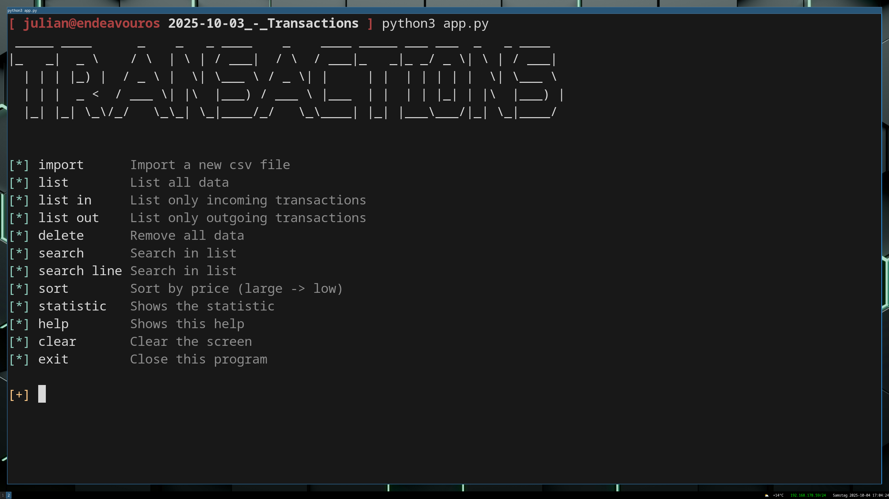

# TransactionsCLI

## Screenshot


## Description
This program written in python is for importing an csv export of your bank. The data will be imported as a json file. You can search or list the entries.

## Execute
- in Terminal
- Windows
  - ```python app_v3.py```
- Linux / MacOS
  - ```python3 app_v3.py```

## Requirements
Python with following modules installed:
- colorama
- pyfiglet

## Platform
- Linux
- Windows
- MacOS
