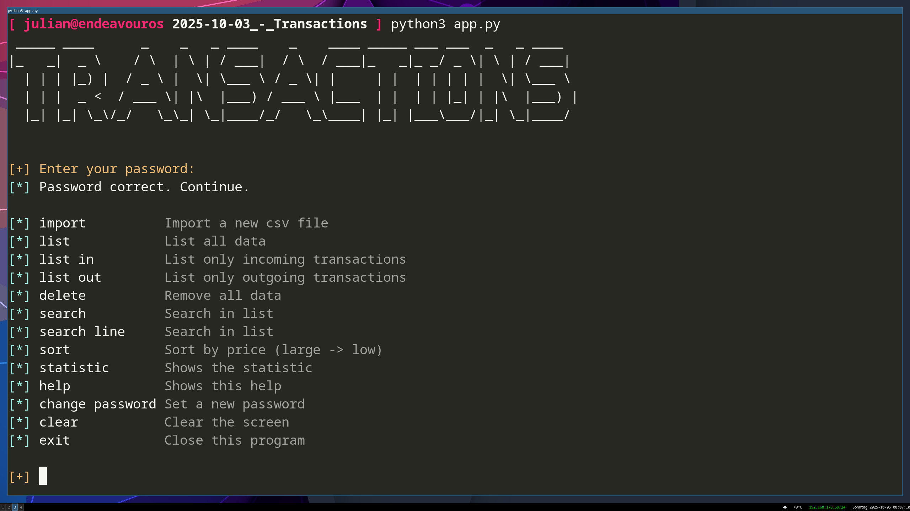

# TransactionsCLI

## Screenshot


## Description
This program written in python is for importing an csv export of your bank. The data will be imported as a json file. You can search or list the entries.

## How to run?
- in Terminal
  - Windows
    - ```python app_v4.py```
  - Linux / MacOS
    - ```python3 app_v4.py```

## Requirements
Python with following modules installed:
- colorama
- pyfiglet

## Platforms
- Linux
- Windows
- MacOS
